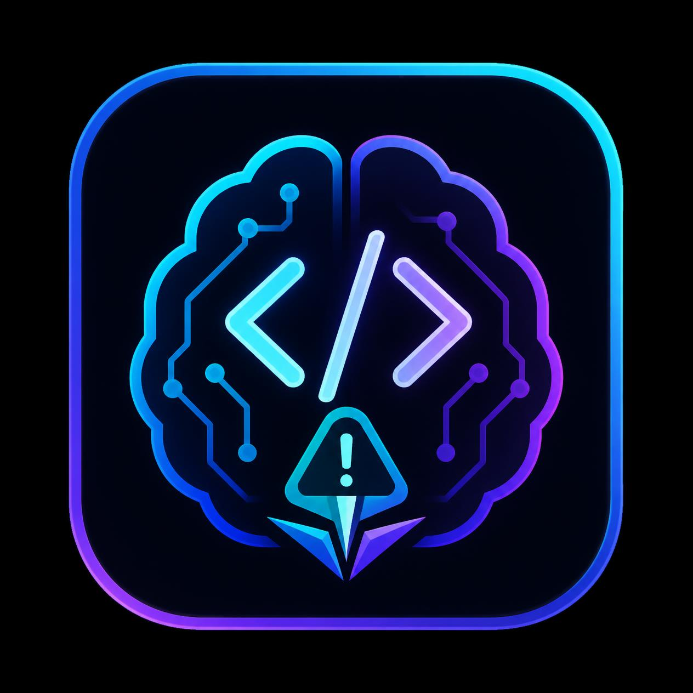

# <p align="center"></p>

<p align="center">
  <a href="https://github.com/shaheaalam244/errorpilot"></a>
  
  
</p>

---

## 🚀 Welcome to ErrorPilot

**ErrorPilot** is a production-grade, highly intuitive AI-powered diagnostic companion built exclusively for VS Code. Designed to instantly eliminate debugging fatigue, it analyzes highlighted compilation bugs, runtime stack traces, or logical code anomalies directly from your workspace and generates high-fidelity resolutions in milliseconds.

Featuring a gorgeous **glassmorphic sidebar interface** with smooth micro-animations, modular framework detection, and a fault-tolerant failover engine, ErrorPilot makes your coding workspace feel alive.

### ⚡ Quick Start — 3 Steps

> **Before you begin**: Make sure you have a free [Google Gemini API Key](https://aistudio.google.com). It's free and takes 30 seconds.

| Step | Action | Details |
|------|--------|---------|
| **1** | 🔑 **Set your API Key** | Press `Cmd+Shift+P` → type **`ErrorPilot: Set AI API Key`** → paste your Gemini API key |
| **2** | 🖱️ **Select your error** | Highlight any bug, error message, or suspicious code in your editor |
| **3** | 🚀 **Analyze it** | Right-click → **"Analyze with ErrorPilot"** — OR — Press `Cmd+Shift+P` → **`Analyze with ErrorPilot`** |

> 💡 **Tip**: The ErrorPilot sidebar will slide open automatically with a 3-part AI diagnostic report — Root Cause, Suggested Fix, and a copy-able Code Solution.

---

## ✨ Features at a Glance

### 🔍 Auto-Inferred Environment Context
Unlike generic chat assistants, ErrorPilot automatically reads your active file to detect the programming language and infer the active runtime framework. It then tailors the AI prompt to your specific tech stack!
* **Languages**: Full native normalization for `TypeScript`, `JavaScript`, `Python`, `HTML`, `CSS`, and more.
* **JS/TS Frameworks**: Recognizes `React`, `Next.js`, `Node.js (Express)`, `Angular`, `Vue.js`, and vanilla environments.
* **Python Environments**: Automatically detects `Django`, `Flask`, `FastAPI`, and `Data Science/AI` setups (Pandas, NumPy, PyTorch, TensorFlow).

### 🔮 Premium Glassmorphic Webview UI
A beautifully responsive sidebar visualizer featuring:
* Premium dark theme with vibrant radial gradients (`#0b0f17`, `#8b5cf6`, `#06b6d4`).
* Dynamic, smooth loading states with a custom **laser-scanning overlay skeleton loader**.
* Collapsible/expandable source code preview box keeping your screen clean.
* One-click interactive **copy-to-clipboard** code block buttons with micro-success feedback.

### 🛡️ Production-Grade Retry & Failover Architecture
Built with robust enterprise-level error handling:
* **Progressive Backoff Retry**: If Google AI rate limits (429) occur, the extension automatically pauses, backs off exponentially, and retries up to 2 times.
* **Seamless Model Failover**: If the preferred model encounters service issues or quota exhaustion, it transitions smoothly through a secure fallback chain: `gemini-3.5-flash` ➔ `gemini-2.5-flash` ➔ `gemini-2.0-flash` ➔ `gemini-1.5-flash`.

### 🔐 Three-Tier Secure API Management
Flexible configuration that puts security first:
1. **VS Code Secret Storage**: Securely caches your API key globally inside VS Code's system keychain.
2. **Environment Variables**: Reads directly from `ERRORPILOT_API_KEY` or `GEMINI_API_KEY` for advanced terminal and team workflows.
3. **Hardcoded Overrides**: A fast developer override inside `extension.ts` for instant custom setups.

---

## 🛠️ How to Use

ErrorPilot integrates seamlessly with your everyday coding habits:

1. **Select Code / Error**: Highlight a bug, a suspicious block of code, or a terminal error stack trace in your active editor.
2. **Right-Click**: Choose **"Analyze with ErrorPilot"** from the context menu.
   *(Alternatively, run `Analyze with ErrorPilot` or `ErrorPilot: Set AI API Key` directly from the VS Code Command Palette: `Cmd+Shift+P` / `Ctrl+Shift+P`)*.
3. **Get Diagnostics**: The ErrorPilot sidebar slides open instantly, showing an active environment scan and loading animation, followed by a beautiful 3-part diagnostic report:
   - 🔥 **Root Cause**: Explains why the error or bug is happening.
   - 🛠️ **Suggested Fix**: A precise, step-by-step action plan to resolve it.
   - 💻 **Interactive Code Solution**: A fully functional, syntax-highlighted code block that you can copy with one click.

---

## ⚙️ Configuration

Customize ErrorPilot to match your workflow:

```json
{
  "errorpilot.model": "gemini-3.5-flash"
}
```
* **Supported Models**: `gemini-3.5-flash`, `gemini-2.5-flash`, `gemini-2.0-flash`, `gemini-1.5-flash`, `gemini-1.5-pro`.

---

## 👨‍💻 Meet the Developer

<p align="center">
  
</p>

### **Shahe Aalam Ansari**
*Founder & CEO, Kinetrexa Software Private Limited*

**Shahe Aalam Ansari** is the Founder and CEO of Kinetrexa Software Private Limited, an IT and software development firm. Based in Lucknow, Uttar Pradesh, he is an active tech entrepreneur specializing in Generative AI, Machine Learning, and Data Science.

As an ambitious innovator and industry leader, Shahe has engineered a suite of revolutionary digital solutions that leverage artificial intelligence to address real-world challenges across multiple sectors:

#### 🛠️ Signature Projects & Ventures

*   **🏢 Kinetrexa Software Private Limited**
    *   **Description**: A premier IT consulting and software development firm operating out of Lucknow, UP. Under Shahe's leadership, Kinetrexa delivers top-tier custom software development, cloud infrastructure design, and enterprise-grade Generative AI integrations to help businesses scale globally.
*   **🏠 Homesarthi**
    *   **Description**: A cutting-edge, technology-driven real estate platform under the **SARTHI** umbrella. It simplifies property search, matching, and residential management by leveraging smart predictive algorithms and artificial intelligence, removing traditional friction for property buyers and sellers.
*   **🩺 Dr. Disease Detector**
    *   **Description**: A revolutionary, high-fidelity medical healthcare application. It leverages deep neural networks, computer vision, and Machine Learning models to analyze clinical datasets and medical imaging, providing highly accurate, fast, and automated early-stage disease detection.
*   **✈️ ErrorPilot**
    *   **Description**: A professional-grade, glassmorphic AI-powered VS Code developer extension. It analyzes runtime errors, compilation bugs, and code snippets in real-time, instantly producing contextual root causes, suggested fixes, and interactive corrected code snippets to enhance developer velocity.

#### 🚀 Kinetrexa's Engineering & Technical Vision
* **Generative AI Integration**: Bringing the bleeding edge of Large Language Models directly into the daily lives of developers and enterprises to optimize speed-to-market.
* **Resilient System Design**: Engineering highly fault-tolerant applications (such as ErrorPilot's progressive backoff retry logic and smooth multi-model failover chains).
* **Immersive Visual Aesthetics**: Creating digital experiences that feel modern and premium, blending glassmorphism, responsive micro-animations, and curated typography.
* **Empowering the Ecosystem**: Proudly operating from Lucknow, UP, to cultivate top-tier engineering talent and deliver world-class IT consulting and software development services globally.

---

## 🤝 Support and Connect

If you love using ErrorPilot, consider starring the repository and connecting with the developer!

* **GitHub**: [@shaheaalam244](https://github.com/shaheaalam244)
* **Project Repository**: [shaheaalam244/errorpilot](https://github.com/shaheaalam244/errorpilot)
* **Get API Key**: [Google AI Studio](https://aistudio.google.com)

*ErrorPilot is licensed under the MIT License. Crafted with ❤️ by Shahe Aalam Ansari.*

<!-- README v0.1.2 — ShaheAalamAnsari -->
